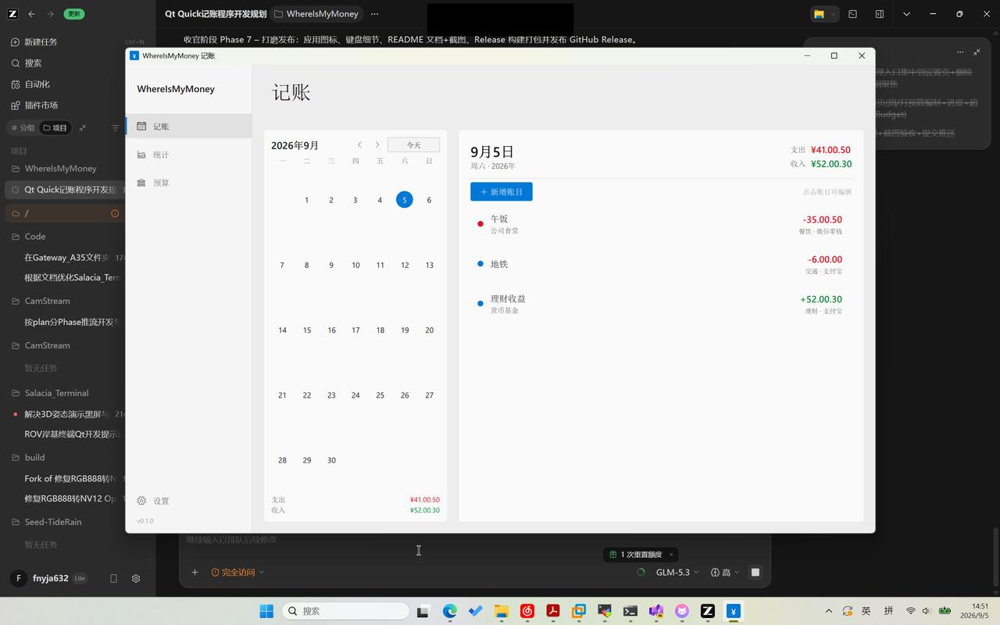
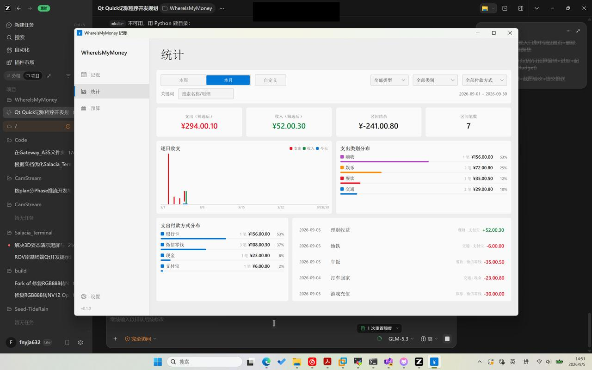
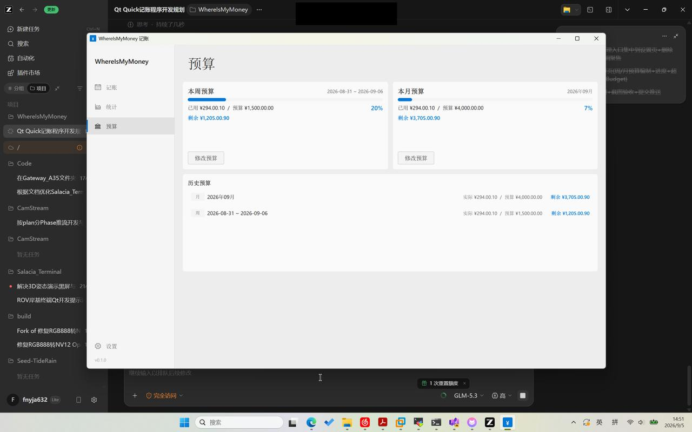
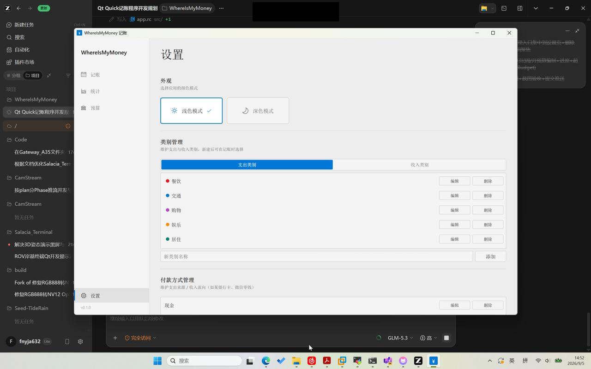

# WhereIsMyMoney 💰

一款 Windows 桌面个人记账程序。界面采用 **Fluent Design**（Windows 10 UWP / Groove Music 风格），支持深色/浅色主题。

| 记账 | 统计 |
|---|---|
|  |  |

| 预算 | 设置 |
|---|---|
|  |  |

## 功能

- **日历记账**：左侧月历点击任意日期即可记录当天账目（今天高亮、支持翻月与"今天"快捷跳转）
- **支出 / 收入**：账目名称、金额（整数分存储，无浮点误差）、详细内容、账目类别、付款方式
- **类别与付款方式自管理**：在设置页增、删、改（删除需二次确认；被账目引用时拒绝删除）；首启自带常用类别（餐饮、交通、购物等）与付款方式（现金、微信零钱、支付宝、银行卡）
- **付款方式** = 支出来源 / 收入流向（某银行卡、微信零钱等）
- **查询与统计**：周 / 月 / 自定义起止日期统计；类型、类别、付款方式、关键词筛选；逐日收支柱状图、类别与付款方式分布、区间明细
- **预算**：周预算 / 月预算编制，进度三态提醒（正常 / 接近 80% 橙色 / 超支红色），**分预算**（按类别细分并跟踪实际支出），历史预算回看
- **深色 / 浅色主题**：设置页一键切换，自动记忆
- 金额千分位格式化、UWP 页面切换动画、Esc 关闭对话框、回车提交表单

## 技术栈

- **UI**：Qt Quick (QML 6)，自绘 Fluent 控件（Basic 样式 + Segoe UI / Segoe MDL2 Assets）
- **数据**：SQLite（QSql），金额以整数"分"存储
- **构建**：CMake ≥ 3.19 + Ninja；MinGW 13 或 MSVC 2022 均可

## 目录结构

```
src/
├── main.cpp                 # 入口：DB 上下文属性、自测钩子、全局字体/图标
├── app.rc                   # Windows exe 图标
├── database/                # 数据层（core 静态库）
│   ├── DatabaseManager.h/.cpp   # schema + CRUD + 统计聚合 + dataChanged 信号
├── qml/
│   ├── Main.qml             # 侧栏导航 + 页面切换动画
│   ├── Theme.qml            # 单例：双主题色板 / 字体 / 金额格式化
│   ├── components/          # Fluent 控件、账目对话框、图表、管理面板
│   └── pages/               # 记账 / 统计 / 预算 / 设置
tests/dbtest/                # 数据层自测（ctest）
```

## 构建与安装

```bash
cmake -B build -G Ninja -DCMAKE_BUILD_TYPE=Release \
      -DCMAKE_PREFIX_PATH=<Qt 路径，如 F:/Qt/6.11.1/mingw_64> \
      -DCMAKE_C_COMPILER=gcc -DCMAKE_CXX_COMPILER=g++
cmake --build build          # 若首次并行编译 qmlcachegen 偶发失败，重跑一次即可
build/WhereIsMyMoney.exe
```

也可以直接下载 **离线安装包**（Qt Installer Framework 制作，含开始菜单/桌面快捷方式与卸载程序）：[GitHub Releases](https://github.com/Furina-1314/WhereIsMyMoney/releases)。

安装器源配置位于 `installer/`（config + package 元数据 + 快捷方式脚本），使用官方 IFW 工具构建：

```powershell
archivegen -c 9 installer/packages/com.whereismymoney.app/data/data.7z <deploy 目录内容>
binarycreator --offline-only -c installer/config/config.xml -p installer/packages WhereIsMyMoney-Setup.exe
```

数据文件位于 `%LOCALAPPDATA%\WhereIsMyMoney\WhereIsMyMoney\whereismymoney.sqlite`。

## 测试

```bash
cmake --build build --target dbtest   # 数据层 83 项断言
build/dbtest.exe

# 端到端自测（QML 对话框/管理/统计/预算全流程，退出码 0 = 通过）
WIMM_TEST_DB=/tmp/t.sqlite WIMM_SEED_TX=1 WIMM_AUTOTEST=1 build/WhereIsMyMoney.exe
```

测试辅助环境变量：`WIMM_TEST_DB`（指定测试库）、`WIMM_SEED_TX`（写入演示数据）、`WIMM_AUTOTEST`（自测后退出）、`WIMM_START_PAGE` / `WIMM_THEME` / `WIMM_OPEN_DIALOG`（截图/调试）。

## 开发过程

项目按 Phase 推进，每阶段构建+测试通过后提交：

- [x] Phase 1: 仓库与工程骨架
- [x] Phase 2: 数据层（SQLite schema、DatabaseManager、自测）
- [x] Phase 3: Fluent UI 基础框架与主布局
- [x] Phase 4: 记账核心（日历、账目增删改查、对话框）
- [x] Phase 5: 查询与统计（区间、筛选、图表）
- [x] Phase 6: 预算（周/月编制、进度、历史）
- [x] Phase 7: 打磨与发布（图标、键盘细节、文档、Release）

## 许可

MIT
